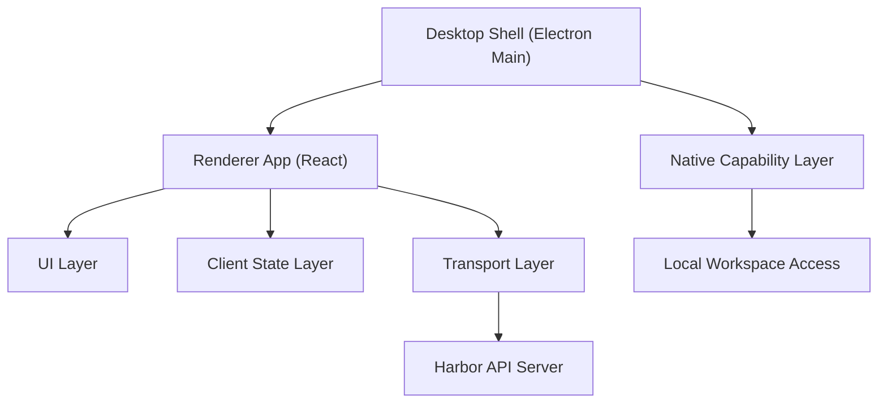

# Harbor 客户端架构设计 v0.1

## 1. 文档目标

本文档用于定义 Harbor 第一阶段桌面客户端的职责、内部模块划分、关键数据流和推荐技术栈。

当前版本以如下目标为前提：

- 客户端形态为桌面应用
- 用户可以在本机选择一个工作目录
- 用户可以围绕该目录发起聊天和后续任务
- UI 体验参考 Codex 桌面端，但功能范围更收敛

## 2. 客户端目标

Harbor 客户端不是简单的聊天窗口，而是一个带“本地工作区入口”的桌面 Agent 客户端。

第一阶段客户端需要同时承担两类职责：

- 提供高质量的聊天和会话体验
- 提供对本地目录和本地文件的受控访问能力

因此，客户端既是 UI 层，也是本地上下文接入层。

## 3. 第一版核心能力

客户端 MVP 只实现以下能力：

- 登录或连接到服务端
- 创建、切换、查看历史会话
- 文本聊天
- 流式展示 Agent 回复
- 上传文件和图片
- 选择一个本地工作目录
- 在当前会话中显示“当前工作目录”
- 将工作目录上下文传递给服务端

第一阶段不实现以下能力：

- 复杂多标签工作区管理
- 本地命令执行终端
- 自动修改本地文件
- 插件系统
- 多窗口协作
- 完整 IDE 能力

## 4. 推荐技术栈

如果目标是“尽快做出一个像 Codex 桌面端一样成熟、克制、质感在线的桌面客户端”，我建议优先采用下面这套栈。

### 4.1 推荐方案

- 桌面壳：Electron
- 前端框架：React
- 语言：TypeScript
- 构建工具：Vite
- UI 样式：Tailwind CSS
- 组件库：shadcn/ui
- 状态管理：Zustand
- 服务端请求缓存：TanStack Query
- Markdown 渲染：react-markdown
- 代码高亮：shiki 或 rehype-highlight
- 图标：lucide-react
- 动画：framer-motion（只做少量）

### 4.2 为什么优先推荐 Electron

当前阶段如果你追求的是“最快做出来”，我更推荐 Electron，而不是 Tauri。

原因如下：

- 团队如果熟悉前端技术，Electron 上手最快
- 本地目录访问、文件操作、系统对话框能力都很成熟
- 社区方案多，踩坑资料多
- 可以更快做出接近 Codex、VS Code 这类桌面应用的交互体验

Tauri 也很好，体积更小、资源占用更低，但第一阶段会引入额外的 Rust 接口开发成本。对“先把产品做出来”来说，Electron 更直接。

### 4.3 当前结论

第一阶段建议技术栈定为：

**Electron + React + TypeScript + Vite + Tailwind CSS + shadcn/ui**

这套方案能最快兼顾：

- 桌面能力
- UI 表现力
- 开发速度
- 后续扩展性

## 5. 客户端总体结构

## 6. 模块划分

### 6.1 Desktop Shell

桌面壳由 Electron Main Process 承担，负责：

- 应用窗口创建与生命周期管理
- 系统菜单
- 文件选择与目录选择对话框
- IPC 通信入口
- 本地原生能力挂载

它不负责具体业务页面渲染，也不直接承载复杂状态逻辑。

### 6.2 Renderer App

Renderer App 是 React 前端应用，是用户直接交互的主界面。它负责：

- 页面布局
- 会话展示
- 消息展示
- 输入框和上传交互
- 当前工作目录显示
- 请求发送和状态反馈

可以把它理解成“运行在桌面壳里的前端客户端”。

### 6.3 Native Capability Layer

这是客户端内的本地能力桥接层，通常通过 Electron 的 preload + IPC 实现。它负责把受控的本地能力暴露给 React 层，例如：

- 打开目录选择器
- 打开文件选择器
- 返回选中的目录路径
- 读取基础文件元信息
- 后续受控扩展本地任务能力

这层的意义是：让前端拥有本地能力，但不要把 Node 原生能力直接裸露给页面代码。

### 6.4 Local Workspace Access

这一层专门处理“本地工作目录”的概念，负责：

- 记录当前选中的工作目录
- 读取目录基础信息
- 构造可传给服务端的工作上下文
- 管理目录切换后的状态同步

第一阶段只做“目录绑定”和“目录上下文展示”，不做复杂目录扫描和自动执行。

### 6.5 UI Layer

UI Layer 负责具体界面呈现，建议拆成以下区域：

- 左侧侧栏
- 主聊天区
- 底部输入区
- 顶部会话信息区
- 右上角状态区

其中最接近 Codex 风格的布局建议是：

- 左侧窄栏负责导航和会话列表
- 中间主体负责对话内容
- 底部固定输入框
- 输入框上方显示附件、目录、模型、连接状态等轻量信息

### 6.6 Client State Layer

客户端状态层建议采用：

- Zustand 管理本地 UI 状态
- TanStack Query 管理远端请求状态和缓存

本地状态主要包括：

- 当前会话 ID
- 当前工作目录
- 侧栏展开状态
- 输入框内容
- 上传中的附件状态
- 当前连接状态

远端状态主要包括：

- 会话列表
- 消息列表
- 用户信息
- 上传结果

### 6.7 Transport Layer

通信层负责客户端与后端之间的交互，建议分为两部分：

- REST API：用于登录、会话列表、消息历史、文件上传下载
- 流式响应通道：用于聊天流式回复和长连接状态同步

这样结构最清晰，也便于后续调试。

## 7. 推荐页面结构

### 7.1 左侧侧栏

左侧侧栏建议包含：

- 新建会话按钮
- 会话列表
- 最近工作区或当前工作区入口
- 设置入口

这一层的视觉目标应接近“轻量 IDE + 聊天工具”，而不是传统企业后台。

### 7.2 主聊天区

主聊天区用于展示：

- 系统消息
- 用户消息
- Agent 回复
- 上传文件卡片
- 流式生成状态

这里的重点是排版和节奏感，要避免把页面做成普通 IM 工具。

### 7.3 底部输入区

底部输入区建议包含：

- 多行输入框
- 发送按钮
- 上传按钮
- 当前工作目录提示
- 可选的模型或模式切换入口

输入区是核心交互区域，视觉质感会直接决定整体产品感受。

## 8. 推荐 UI 风格

### 8.1 风格方向

建议采用：

- 深色主题为主
- 低饱和中性色背景
- 清晰分层的侧栏和主面板
- 较克制的高亮色
- 轻量边框 + 大圆角 + 稳定留白

### 8.2 为什么适合这种风格

这种风格适合工程团队工具，原因是：

- 更接近开发者熟悉的工作环境
- 长时间使用更舒适
- 更容易承载代码、日志、聊天、文件卡片等混合内容

### 8.3 实现建议

建议建立一套基础设计 token，例如：

- 背景层级颜色
- 文本层级颜色
- 边框颜色
- 主强调色
- 成功/告警/错误色
- 统一的圆角和间距体系

不要在第一版里堆很多花哨动效，重点是：

- 稳
- 清晰
- 克制
- 像一个真正可长期使用的开发工具

## 9. 关键交互流程

### 9.1 新建会话

1. 用户点击“新建会话”
2. 客户端创建本地草稿会话状态
3. 首次发送消息后向服务端正式创建会话

### 9.2 选择工作目录

1. 用户点击“选择目录”
2. Electron 调起本地目录选择器
3. 客户端记录当前目录
4. 当前目录在 UI 中显示
5. 之后发送消息时附带该上下文信息

### 9.3 发送消息

1. 用户输入文本
2. 用户可附加文件或图片
3. 客户端将消息与上下文发送到服务端
4. Agent 回复通过流式响应通道返回
5. UI 实时渲染回复内容

## 10. 安全边界

客户端必须明确区分：

- 哪些能力可以直接在前端调用
- 哪些能力必须经过受控的本地桥接层

第一阶段建议遵循以下原则：

- React 页面不直接暴露 Node 全能力
- 本地目录访问通过受控 IPC 能力提供
- 默认只允许“用户主动选择”的目录进入上下文
- 不做后台静默扫描整个磁盘

## 11. 当前阶段的实现建议

如果目标是尽快把第一版做出来，我建议按以下顺序推进：

1. 搭建 Electron + React + TypeScript + Vite 基础工程
2. 先做主界面静态布局
3. 再接入本地目录选择能力
4. 再接会话列表和消息流
5. 最后接文件上传、历史记录和连接状态

这样可以先把“像一个可用产品”的壳做出来，再逐步把后端链路接进去。

## 12. 一句话总结

Harbor 客户端第一阶段应采用一套“桌面壳 + React 渲染层 + 本地能力桥接层 + 聊天工作区 UI”的结构。技术上优先选择 Electron + React + TypeScript，以最快速度做出一个接近 Codex 桌面端气质、同时具备本地工作目录能力的客户端。
