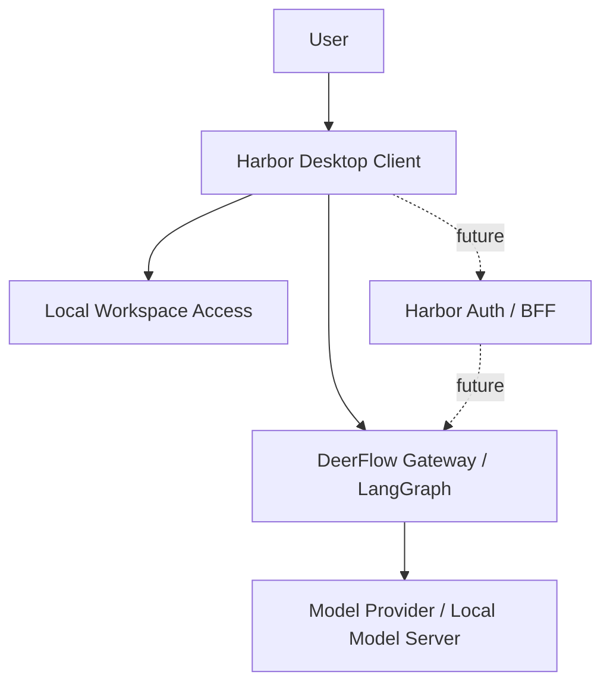

# Harbor 系统架构设计 v0.1

## 1. 文档目标

本文档用于描述 Harbor 第一阶段的系统架构设计。当前版本基于以下前提：

- Harbor 面向团队内部使用
- 当前阶段直接复用本仓库中的 DeerFlow 作为后端 Agent Runtime
- 用户通过桌面客户端应用使用系统
- 用户可以在本机选择一个工作目录，并围绕该目录发起对话和任务

本版本只覆盖基础能力，不包含后续的性能分析、流水线验证、复杂 Skill 编排、账号体系等专项能力设计。

## 2. 架构目标

Harbor 第一阶段的架构目标如下：

- 为团队提供统一的 Agent 使用入口
- 支持聊天、文件上传下载、历史会话查看
- 支持用户在本地选择工作目录，并将该目录作为当前会话上下文
- 将平台业务、Agent 运行和模型推理分层解耦
- 为后续扩展 Skill、任务执行和工程分析能力预留边界

## 3. 关键架构决策

### 3.1 客户端形态

第一版优先采用桌面客户端应用。

原因如下：

- 用户需要在本地机器上选择一个目录作为工作空间
- 用户后续可能希望围绕该目录执行任务，而不仅仅是上传单个文件
- 目录访问能力需要本地受控桥接，不适合继续沿用页面式入口

因此，Harbor 客户端建议采用桌面客户端形式，例如：

- Electron
- Tauri

当前阶段先不锁定具体框架，但架构上按“桌面客户端”设计。

### 3.2 中心化与本地化结合

Harbor 不是一个完全本地单机应用，也不是纯中心化服务，而是二者结合：

- 平台能力集中部署在服务端
- 用户工作目录存在于用户本机
- 客户端负责连接这两个世界

### 3.3 当前先直连 DeerFlow，后续再补 Harbor Auth / BFF

当前阶段不先做 Harbor 自己的登录鉴权后端，而是：

- Harbor Desktop 直接调用 DeerFlow
- 先把真实对话链路跑通
- 后续如果需要账号、鉴权、审计和权限，再在 DeerFlow 前面补 Harbor 自己的 Auth / BFF 层

这样做的原因是：

- DeerFlow 已经具备现成的线程、runs、uploads、artifacts 等接口
- 当前项目最需要验证的是 Harbor 能否稳定承载真实 Agent
- 账号体系不是现在跑通主链路的前置条件

### 3.4 Agent 层与模型层分离

系统中需要明确区分：

- Agent Runtime：负责上下文组织、任务执行、工具/Skill 接入
- Model Server：只负责模型推理

这样可以避免把所有智能能力都堆在模型服务里，也方便后续替换模型或 Agent 框架。

## 4. 总体架构

## 5. 组件职责

### 5.1 User

User 是 Harbor 的实际使用者，即团队内部成员。用户通过客户端发起对话、选择工作目录、上传文件、查看结果。

### 5.2 Harbor Desktop Client

桌面客户端是用户直接使用的应用程序，是 Harbor 的客户端层。它负责：

- 提供聊天界面
- 提供会话列表和历史记录入口
- 支持文件和图片上传
- 允许用户在本机选择一个工作目录
- 将当前工作目录与当前会话进行绑定
- 将用户请求发送到后端服务
- 接收并展示 Agent 的流式回复

桌面客户端的核心价值是：在保留现代聊天交互体验的同时，获得对本地工作目录的可控访问能力。

### 5.3 Local Workspace Access

Local Workspace Access 指客户端侧的本地目录访问能力。它可以是：

- 客户端内嵌的一层本地能力模块
- 或后续拆分成单独的本地辅助进程

这一层负责：

- 打开和绑定用户选择的本地目录
- 读取目录中的文件信息
- 为当前会话提供“工作目录上下文”
- 后续支持在该目录下执行受控任务

这一层非常关键，因为服务端无法直接访问用户机器上的目录。也就是说，只有客户端本地能力才能真正理解“当前工作目录”这一概念。

### 5.4 DeerFlow Gateway / LangGraph

DeerFlow 是 Harbor 当前阶段直接复用的后端运行层，负责：

- 线程管理
- runs 执行
- Agent Runtime
- 文件上传与 artifact 能力
- 模型与技能配置读取

对 Harbor 来说，DeerFlow 当前就是“可以直接消费的 Agent 后端”。

### 5.5 Model Provider / Local Model Server

模型推理层可以是：

- DeerFlow 配置好的云模型 provider
- 本地模型服务，例如 vLLM 或 Ollama

这一层只负责推理，不负责 Harbor 的业务逻辑。

### 5.6 Harbor Auth / BFF（后续）

这一层不是当前阶段的必须项，但后续如果 Harbor 要支持账号、登录、局域网多人使用和权限控制，则应在 DeerFlow 前面新增 Harbor 自己的后端层。

它未来负责：

- 登录态
- 用户鉴权
- 权限控制
- 用户与 DeerFlow thread 的映射
- 审计和限流

## 6. 关键数据流

### 6.1 基础聊天流程

1. 用户打开桌面客户端
2. 用户创建或打开一个会话
3. 用户输入消息并发送
4. 客户端将请求直接发送到 DeerFlow
5. DeerFlow 执行 Agent Runtime 并调用模型
6. 回复返回给客户端并展示

### 6.2 工作目录绑定流程

1. 用户在桌面客户端中选择本地目录
2. 客户端记录该目录并将其绑定到当前会话
3. 客户端提取必要的目录上下文信息
4. 客户端将这些上下文作为请求提示的一部分发送给 DeerFlow

这里需要注意，DeerFlow 当前并不会因为 Harbor 提交了一个 Windows 本地路径，就自动获得对该目录的访问权。客户端当前只能传递受控的上下文信息、文件内容或后续定义好的本地任务描述。

### 6.3 文件上传流程

1. 用户在客户端选择文件或图片
2. 客户端将文件上传至 DeerFlow
3. DeerFlow 将文件写入当前 thread 的 uploads 目录
4. Agent Runtime 在需要时读取附件引用或内容

## 7. 架构边界

### 7.1 客户端负责什么

- 用户交互
- 本地目录选择
- 本地文件访问入口
- 当前工作上下文组织

### 7.2 服务端负责什么

- 当前阶段：DeerFlow 负责线程、runs、上传、artifact 与 Agent 执行
- 后续阶段：Harbor Auth / BFF 再承接账号、鉴权、权限和审计

### 7.3 模型层负责什么

- 纯推理能力

模型层不承担平台业务，不直接暴露给用户。

## 8. 当前版本不做的内容

本架构设计 v0.1 明确不覆盖以下内容：

- 复杂 Skill 调度
- 自动流水线执行
- 多 Agent 协作
- UE Trace 专项解析
- 本地目录下的复杂命令执行框架
- 分布式任务系统
- 多租户权限体系

这些能力将在后续版本中逐步补充。

## 9. 风险与注意事项

### 9.1 仅有桌面客户端还不等于具备本地任务执行能力

如果后续需求从“选择本地目录进行对话”升级为“让 Agent 在本地目录中执行任务”，那么仅有聊天客户端是不够的。届时需要进一步设计：

- 本地任务执行器
- 本地命令权限模型
- 本地文件写回机制
- 本地审计与安全控制

### 9.2 不建议让服务端直接理解客户端本地路径

客户端本地路径对服务端没有直接意义，因此所有目录上下文都应经过客户端转换后再上传或提交。

### 9.3 当前本地路径只具备“上下文意义”

Harbor 当前选择的本地路径，只是客户端侧的本地上下文，不代表 DeerFlow 已经自动挂载、同步或可直接操作这个目录。

如果未来要让 Agent 真正处理该目录，需要再设计本地代理、文件同步或受控执行机制。

## 10. 当前建议

第一阶段建议采用以下实现思路：

- 客户端采用桌面应用
- 当前先直接接入 DeerFlow
- 本地目录能力先做“选择目录 + 建立上下文”，不急于实现复杂本地执行
- 先跑通聊天、文件上传、历史会话、目录绑定这四条主链路
- 后续如需账号与权限，再在 DeerFlow 前面补 Harbor Auth / BFF

## 11. 一句话总结

Harbor 第一阶段应设计为一个“桌面客户端直连 DeerFlow”的混合架构：客户端负责用户交互和本地工作目录接入，DeerFlow 负责当前阶段的 Agent 运行；后续再在前面补 Harbor 自己的登录鉴权层。
