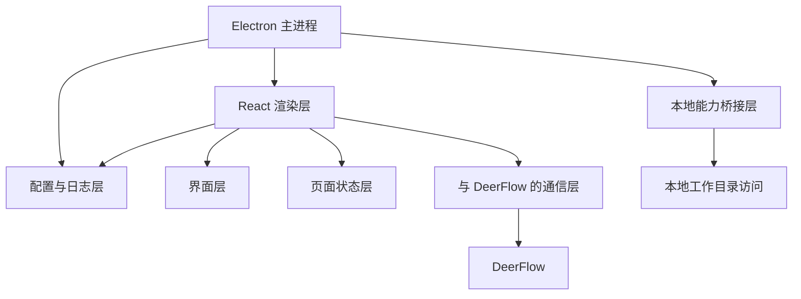

# Harbor 客户端架构设计 v0.1

## 1. 文档目标

本文档用于定义 Harbor 第一阶段桌面客户端的职责、内部模块划分、关键数据流和当前推荐技术栈。

当前版本以以下目标为前提：

- 客户端形态为桌面应用
- 用户可以在本机选择一个工作目录
- 用户可以围绕该目录发起聊天和后续任务
- 界面体验参考 Codex，但功能范围更收敛

## 2. 客户端目标

Harbor 客户端不是一个普通聊天窗口，而是一个带“本地工作区入口”的桌面 Agent 客户端。

第一阶段客户端需要同时承担两类职责：

- 提供清晰稳定的聊天与会话体验
- 提供对本地目录和本地文件的受控访问能力

因此，客户端既是界面层，也是本地上下文接入层。

## 3. 第一版核心能力

客户端 MVP 只实现以下能力：

- 创建、切换、查看历史会话
- 文本聊天
- 展示真实 Agent 回复
- 上传文件和图片
- 选择本地工作目录
- 在当前会话中显示“当前工作目录”
- 将工作目录上下文传递给 DeerFlow
- 在界面里修改 DeerFlow 地址等本地配置
- 记录主进程与渲染层日志

第一阶段不实现以下能力：

- 复杂多标签工作区管理
- 本地命令执行终端
- 自动修改本地文件
- 插件系统
- 多窗口协作
- 完整 IDE 能力

## 4. 当前技术栈结论

当前阶段技术栈确定为：

- Electron
- React
- TypeScript
- Vite
- CSS

原因很直接：

- 已经跑通当前工程
- 适合承载本地目录、配置中心、日志系统和后续更多本地能力
- 对 DeerFlow 联调足够灵活

## 5. 客户端总体结构

## 6. 模块划分

### 6.1 Electron 主进程

主进程负责：

- 应用窗口创建与生命周期管理
- 系统菜单与窗口外壳
- 文件选择与目录选择对话框
- 配置文件读写
- DeerFlow HTTP 请求
- 主进程日志

### 6.2 React 渲染层

渲染层负责：

- 页面布局
- 会话展示
- 消息展示
- 输入框与设置面板交互
- 当前工作目录展示
- 页面状态更新

### 6.3 本地能力桥接层

当前通过 Electron 的预加载层 + IPC 实现，用来把受控的本地能力暴露给 React 层，例如：

- 打开目录选择器
- 读取与保存配置
- 测试 DeerFlow 连接
- 发送聊天消息
- 写渲染层日志

### 6.4 本地工作目录访问

这一层专门处理“本地工作目录”的概念，负责：

- 记录当前选中的工作目录
- 在界面里展示该目录
- 把该目录作为上下文提示发送给 DeerFlow

当前阶段它只有“上下文意义”，还不具备“让 DeerFlow 直接操作本地目录”的能力。

### 6.5 界面层

当前界面结构主要包含：

- 顶部菜单栏
- 左侧会话栏
- 中央消息区
- 底部输入区
- 配置中心弹层

### 6.6 页面状态层

当前页面状态主要由 React state 管理，包括：

- 当前会话
- 当前消息列表
- 当前工作目录
- 输入框内容
- DeerFlow 连接状态
- 设置面板开关
- 配置草稿值

### 6.7 与 DeerFlow 的通信层

当前通信层由 Electron 主进程承接，主要调用：

- `GET /health`
- `POST /api/runs/wait`

后续可逐步补：

- `POST /api/runs/stream`
- `POST /api/threads/{thread_id}/uploads`
- `GET /api/threads/search`
- `GET /api/threads/{thread_id}/state`

### 6.8 配置与日志层

当前这层已经落地，不是概念预留，主要负责：

- 读取与保存桌面端本地配置
- 暴露 DeerFlow 地址配置入口
- 记录主进程日志
- 记录渲染层日志
- 在启动失败、页面加载失败、请求失败时保留排障信息

当前配置文件由 Electron 写入用户可写目录；日志则按运行方式分别落盘：

- 开发态：相对当前工作目录写入 `storage/logs/desktop/`
- 打包后的 exe：优先写入可执行文件同级的 `logs/`

## 7. 推荐页面结构

### 7.1 左侧会话栏

建议包含：

- 新建会话
- 会话列表
- 品牌区域

### 7.2 主消息区

用于展示：

- 用户消息
- Agent 回复
- 错误提示
- 加载状态

### 7.3 底部输入区

建议包含：

- 多行输入框
- 发送按钮
- 输入提示

### 7.4 配置中心

当前已承载：

- DeerFlow 地址
- 配置文件路径展示
- 测试连接
- 打开配置文件

### 7.5 日志与排障

当前客户端已经把日志作为基础能力接入，主要覆盖：

- 主进程启动
- 窗口创建与页面加载
- 配置文件读写
- DeerFlow 健康检查与聊天请求
- 渲染层未捕获异常
- 渲染进程崩溃或加载失败

后续适合作为统一配置入口继续扩展更多设置项。

## 8. 关键交互流程

### 8.1 新建会话

1. 用户点击“新建对话”
2. 客户端重置当前消息列表
3. 客户端创建新的本地 thread 标识

### 8.2 选择工作目录

1. 用户点击“选择目录”
2. Electron 调起系统目录选择器
3. 客户端记录当前目录
4. 当前目录在界面中展示

### 8.3 发送消息

1. 用户输入文本
2. 客户端先把用户消息加入当前消息列表
3. React 通过预加载层 API 调主进程
4. 主进程调用 DeerFlow
5. DeerFlow 返回结果
6. 客户端提取 AI 回复并显示

## 9. 安全边界

客户端必须明确区分：

- 哪些能力可以直接在页面里调用
- 哪些能力必须通过受控的本地桥接层提供

当前阶段坚持以下原则：

- React 页面不直接暴露 Node.js 全能力
- 本地目录访问通过受控 IPC 提供
- 默认只允许用户主动选择的目录进入上下文
- 不做静默扫描整盘

## 10. 一句话总结

Harbor 客户端当前采用的是“Electron 主进程 + React 渲染层 + 预加载安全桥接 + 配置与日志层 + 本地工作区上下文”的结构，目标是在保证扩展性的前提下，先把桌面端真实链路做稳。
