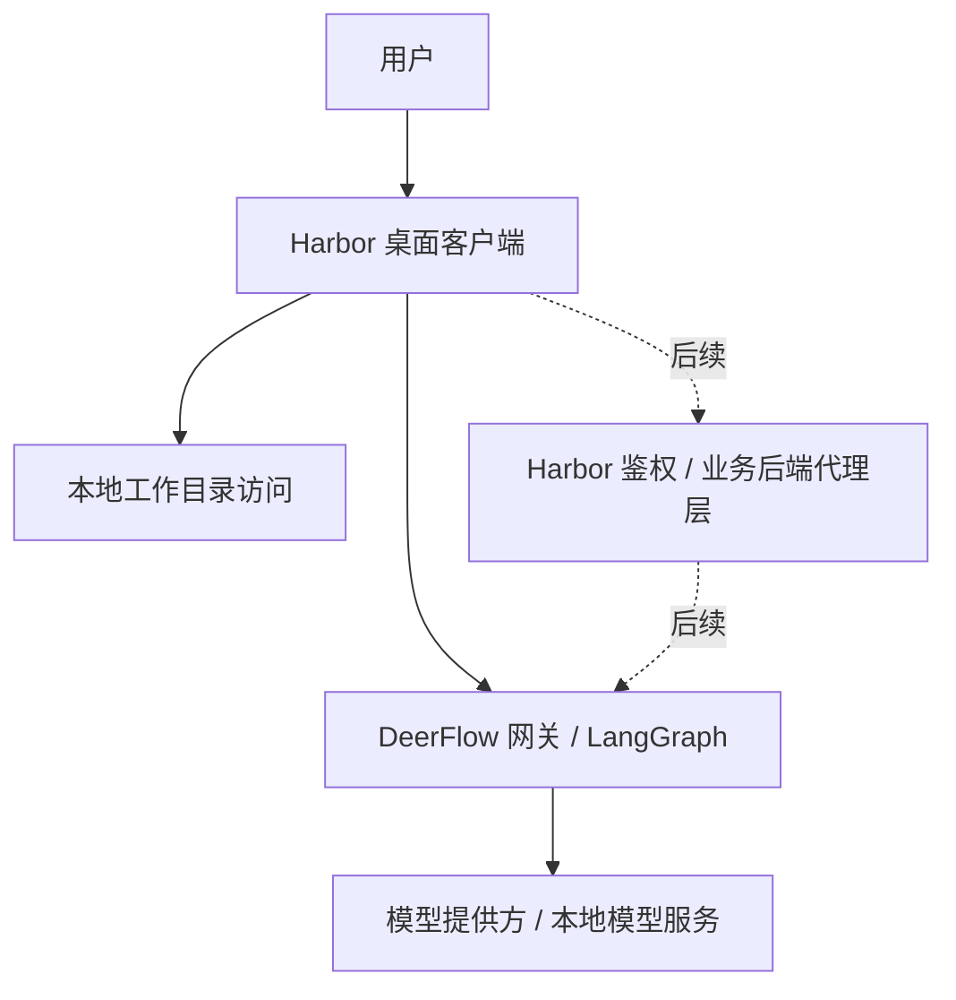

# Harbor 系统架构设计 v0.1

## 1. 文档目标

本文档用于描述 Harbor 第一阶段的系统架构设计。当前版本基于以下前提：

- Harbor 面向团队内部使用
- 当前阶段直接复用本仓库中的 DeerFlow 作为后端 Agent Runtime
- 用户通过桌面客户端应用使用系统
- 用户可以在本机选择一个工作目录，并围绕该目录发起对话和任务

本版本只覆盖基础能力，不包含后续的性能分析、流水线验证、复杂技能编排、账号体系等专项能力设计。

## 2. 架构目标

Harbor 第一阶段的架构目标如下：

- 为团队提供统一的 Agent 使用入口
- 支持聊天、文件上传下载、历史会话查看
- 支持用户在本地选择工作目录，并将该目录作为当前会话上下文
- 将平台业务、Agent 运行和模型推理解耦
- 为后续扩展技能、任务执行和工程分析能力预留边界

## 3. 关键架构决策

### 3.1 客户端形态

第一版优先采用桌面客户端应用。

原因如下：

- 用户需要在本地机器上选择一个目录作为工作空间
- 用户后续可能希望围绕该目录执行任务，而不仅仅是上传单个文件
- 目录访问能力需要本地受控桥接，不适合继续沿用纯网页入口

因此，Harbor 客户端建议采用桌面客户端形式，例如：

- Electron
- Tauri

当前阶段已经采用 Electron。

### 3.2 当前先直连 DeerFlow，后续再补 Harbor 鉴权 / 业务后端代理层

当前阶段不先做 Harbor 自己的登录鉴权后端，而是：

- Harbor 桌面客户端直接调用 DeerFlow
- 先把真实对话链路跑通
- 后续如果需要账号、鉴权、审计和权限，再在 DeerFlow 前面补 Harbor 自己的鉴权 / 业务后端代理层

### 3.3 Agent 层与模型层分离

系统中需要明确区分：

- Agent Runtime：负责上下文组织、任务执行、工具 / 技能接入
- 模型服务：只负责模型推理

这意味着 Harbor 当前虽然准备先部署 Gemma 4 E4B，但后续如果切到 Qwen3、远程 OpenAI-compatible 模型或其他 DeerFlow 支持的提供方，原则上不需要重写客户端，只需要调整 DeerFlow 的模型配置与对应推理服务。

## 4. 总体架构

## 5. 组件职责

### 5.1 用户

用户是 Harbor 的实际使用者，即团队内部成员。用户通过客户端发起对话、选择工作目录、上传文件、查看结果。

### 5.2 Harbor 桌面客户端

桌面客户端是 Harbor 的客户端层，负责：

- 提供聊天界面
- 提供会话列表和历史记录入口
- 支持文件和图片上传
- 允许用户在本机选择一个工作目录
- 将当前工作目录与当前会话进行绑定
- 将用户请求发送到 DeerFlow
- 接收并展示 Agent 的回复

### 5.3 本地工作目录访问

这一层负责：

- 打开和绑定用户选择的本地目录
- 读取目录的基础信息
- 为当前会话提供“工作目录上下文”

当前阶段它只有“上下文意义”，还不具备“DeerFlow 直接操作本地目录”的能力。

### 5.4 DeerFlow 网关 / LangGraph

DeerFlow 是 Harbor 当前阶段直接复用的后端运行层，负责：

- 线程管理
- runs 执行
- Agent Runtime
- 文件上传与 artifact 能力
- 模型与技能配置读取

### 5.5 模型提供方 / 本地模型服务

模型推理层可以是：

- DeerFlow 配置好的云模型提供方
- 本地模型服务，例如 vLLM 或 Ollama
- 通过 OpenAI-compatible 网关暴露出来的远程模型服务

这一层只负责推理，不负责 Harbor 的业务逻辑。

### 5.6 Harbor 鉴权 / 业务后端代理层（后续）

这一层不是当前阶段的必须项，但后续如果 Harbor 要支持账号、登录、局域网多人使用和权限控制，则应在 DeerFlow 前面新增 Harbor 自己的后端层。

它未来负责：

- 登录态
- 用户鉴权
- 权限控制
- 用户与 DeerFlow thread 的映射
- 审计和限流

## 6. 关键数据流

### 6.1 基础聊天流程

1. 用户打开桌面客户端
2. 用户创建或打开一个会话
3. 用户输入消息并发送
4. 客户端将请求直接发送到 DeerFlow
5. DeerFlow 执行 Agent Runtime 并调用模型
6. 回复返回给客户端并展示

### 6.2 工作目录绑定流程

1. 用户在桌面客户端中选择本地目录
2. 客户端记录该目录并将其绑定到当前会话
3. 客户端提取必要的目录上下文信息
4. 客户端将这些上下文作为请求提示的一部分发送给 DeerFlow

这里需要注意，DeerFlow 当前并不会因为 Harbor 提交了一个 Windows 本地路径，就自动获得对该目录的访问权。

### 6.3 文件上传流程

1. 用户在客户端选择文件或图片
2. 客户端将文件上传至 DeerFlow
3. DeerFlow 将文件写入当前线程的 uploads 目录
4. Agent Runtime 在需要时读取附件引用或内容

## 7. 架构边界

### 7.1 客户端负责什么

- 用户交互
- 本地目录选择
- 本地文件访问入口
- 当前工作上下文组织

### 7.2 当前服务端负责什么

- DeerFlow 负责线程、runs、上传、artifact 与 Agent 执行
- 后续 Harbor 鉴权 / 业务后端代理层再承接账号、鉴权、权限和审计

### 7.3 模型层负责什么

- 纯推理能力

模型层不承担平台业务，不直接暴露给用户。

## 8. 风险与注意事项

### 8.1 仅有桌面客户端还不等于具备本地任务执行能力

如果后续需求从“选择本地目录进行对话”升级为“让 Agent 在本地目录中执行任务”，那么仅有聊天客户端是不够的。届时需要进一步设计：

- 本地任务执行器
- 本地命令权限模型
- 本地文件写回机制
- 本地审计与安全控制

### 8.2 当前本地路径只具备“上下文意义”

Harbor 当前选择的本地路径，只是客户端侧的本地上下文，不代表 DeerFlow 已经自动挂载、同步或可直接操作这个目录。

### 8.3 不建议把 Harbor 账号体系直接写进 DeerFlow

后续如果需要正式登录系统，正确方向是“在前面加一层”，而不是“往 DeerFlow 里硬塞整套平台逻辑”。

## 9. 一句话总结

Harbor 第一阶段应设计为一个“桌面客户端直连 DeerFlow”的混合架构：客户端负责用户交互和本地工作目录接入，DeerFlow 负责当前阶段的 Agent 运行；后续再在前面补 Harbor 自己的登录鉴权层。
