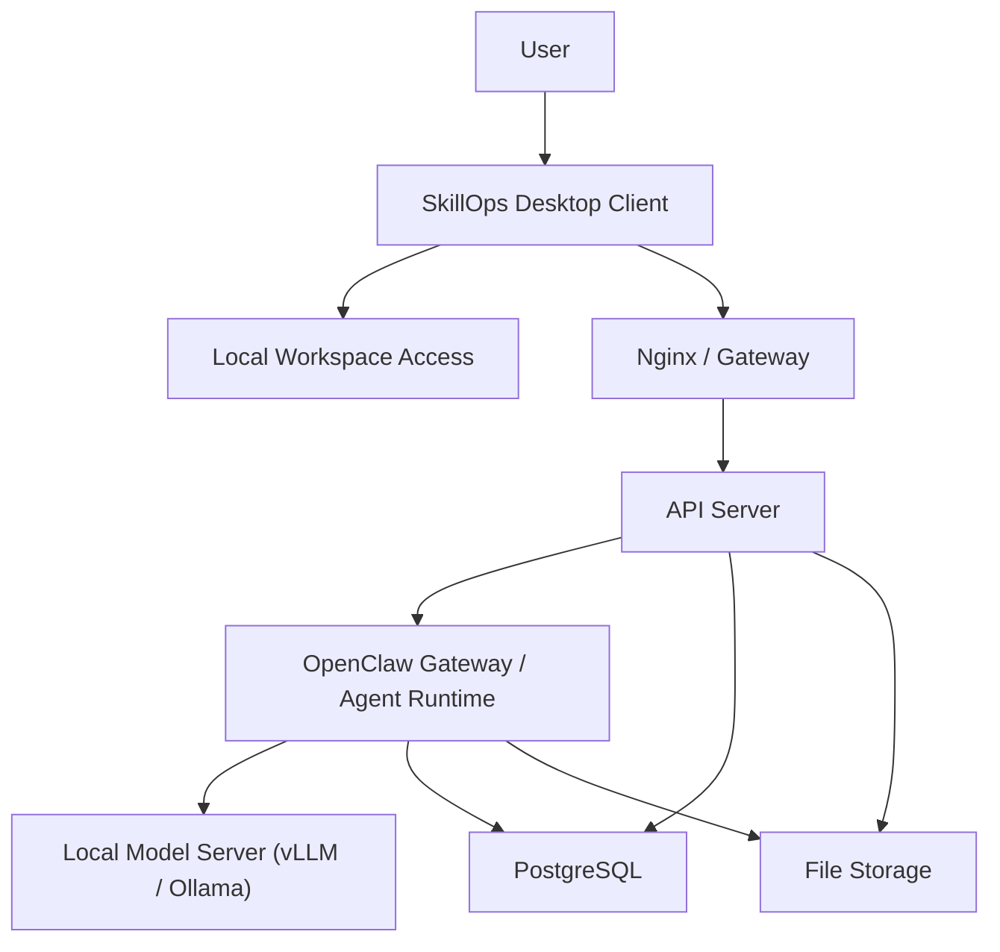

# SkillOps 系统架构设计 v0.1

## 1. 文档目标

本文档用于描述 SkillOps 第一阶段的系统架构设计。当前版本基于以下前提：

- SkillOps 面向团队内部使用
- 采用本地部署的开源 Agent 和本地模型服务
- 用户通过桌面客户端应用使用系统
- 用户可以在本机选择一个工作目录，并围绕该目录发起对话和任务

本版本只覆盖基础能力，不包含后续的性能分析、流水线验证、复杂 Skill 编排等专项能力设计。

## 2. 架构目标

SkillOps 第一阶段的架构目标如下：

- 为团队提供统一的 Agent 使用入口
- 支持聊天、文件上传下载、历史会话查看
- 支持用户在本地选择工作目录，并将该目录作为当前会话上下文
- 将平台业务、Agent 运行和模型推理分层解耦
- 为后续扩展 Skill、任务执行和工程分析能力预留边界

## 3. 关键架构决策

### 3.1 客户端形态

第一版优先采用桌面客户端应用。

原因如下：

- 用户需要在本地机器上选择一个目录作为工作空间
- 用户后续可能希望围绕该目录执行任务，而不仅仅是上传单个文件
- 目录访问能力需要本地受控桥接，不适合继续沿用页面式入口

因此，SkillOps 客户端建议采用桌面客户端形式，例如：

- Electron
- Tauri

当前阶段先不锁定具体框架，但架构上按“桌面客户端”设计。

### 3.2 中心化与本地化结合

SkillOps 不是一个完全本地单机应用，也不是纯中心化服务，而是二者结合：

- 平台能力集中部署在服务端
- 用户工作目录存在于用户本机
- 客户端负责连接这两个世界

### 3.3 Agent 层与模型层分离

系统中需要明确区分：

- Agent Runtime：负责上下文组织、任务执行、工具/Skill 接入
- Model Server：只负责模型推理

这样可以避免把所有智能能力都堆在模型服务里，也方便后续替换模型或 Agent 框架。

## 4. 总体架构

## 5. 组件职责

### 5.1 User

User 是 SkillOps 的实际使用者，即团队内部成员。用户通过客户端发起对话、选择工作目录、上传文件、查看结果。

### 5.2 SkillOps Desktop Client

桌面客户端是用户直接使用的应用程序，是 SkillOps 的客户端层。它负责：

- 提供聊天界面
- 提供会话列表和历史记录入口
- 支持文件和图片上传
- 允许用户在本机选择一个工作目录
- 将当前工作目录与当前会话进行绑定
- 将用户请求发送到后端服务
- 接收并展示 Agent 的流式回复

桌面客户端的核心价值是：在保留现代聊天交互体验的同时，获得对本地工作目录的可控访问能力。

### 5.3 Local Workspace Access

Local Workspace Access 指客户端侧的本地目录访问能力。它可以是：

- 客户端内嵌的一层本地能力模块
- 或后续拆分成单独的本地辅助进程

这一层负责：

- 打开和绑定用户选择的本地目录
- 读取目录中的文件信息
- 为当前会话提供“工作目录上下文”
- 后续支持在该目录下执行受控任务

这一层非常关键，因为服务端无法直接访问用户机器上的目录。也就是说，只有客户端本地能力才能真正理解“当前工作目录”这一概念。

### 5.4 Nginx / Gateway

Nginx 是服务端统一入口，负责：

- 统一对外暴露访问地址
- 转发 API 请求
- 转发流式响应请求
- 提供基础网关能力，例如连接管理、请求大小限制、后续 HTTPS 接入

在桌面客户端方案中，Nginx 不再承担前端静态页面托管的主要职责，但仍然适合作为统一接入层。

### 5.5 API Server

API Server 是 SkillOps 的平台业务后端，负责：

- 用户认证和会话鉴权
- 会话管理
- 消息管理
- 附件上传下载
- 保存消息、会话和附件元数据
- 接收客户端请求并调用 Agent Runtime
- 将客户端的工作目录上下文转换为平台可理解的请求数据

它负责的是“平台业务逻辑”，而不是模型推理本身。

### 5.6 OpenClaw Gateway / Agent Runtime

OpenClaw 所在层是 SkillOps 的 Agent 运行层，负责：

- 组织对话上下文
- 承载 Agent Runtime
- 调用底层模型服务
- 处理 Agent 执行过程中的消息流
- 为后续 Skill、工具调用、任务编排提供扩展位置

这一层处于平台业务层和模型推理层之间，是 SkillOps 的智能能力承载层。

### 5.7 Local Model Server

Local Model Server 是模型推理层，推荐使用：

- vLLM
- Ollama

它的职责是：

- 加载本地部署的大模型
- 接收 Agent Runtime 发来的推理请求
- 执行文本生成
- 返回回复结果或 token 流

模型服务不负责用户、会话、文件权限、附件管理等平台能力。

### 5.8 PostgreSQL

PostgreSQL 是系统的结构化数据存储层，主要保存：

- 用户信息
- 会话信息
- 消息记录
- 附件元数据
- 审计日志
- 配置信息

数据库适合存储可查询、可关联、可追踪的业务数据。

### 5.9 File Storage

File Storage 是系统的非结构化文件存储层，主要保存：

- 用户上传的图片
- 文档附件
- 导出结果
- 后续产生的报告、分析产物等文件

第一阶段可以采用本地文件系统，后续可替换为 MinIO 等对象存储。

## 6. 关键数据流

### 6.1 基础聊天流程

1. 用户打开桌面客户端
2. 用户创建或打开一个会话
3. 用户输入消息并发送
4. 客户端将请求发送到 API Server
5. API Server 调用 OpenClaw
6. OpenClaw 调用本地模型服务生成回复
7. 回复流式返回给客户端
8. 会话与消息记录保存到 PostgreSQL

### 6.2 工作目录绑定流程

1. 用户在桌面客户端中选择本地目录
2. 客户端记录该目录并将其绑定到当前会话
3. 客户端提取必要的目录上下文信息
4. API Server 将这些上下文作为请求的一部分传递给 Agent Runtime

这里需要注意，服务端不能直接使用客户端的本地绝对路径。客户端只能传递受控的上下文信息、文件内容或后续定义好的本地任务描述。

### 6.3 文件上传流程

1. 用户在客户端选择文件或图片
2. 客户端将文件上传至 API Server
3. API Server 将文件写入 File Storage
4. API Server 将附件元数据写入 PostgreSQL
5. 当前消息与附件建立关联
6. Agent Runtime 在需要时读取附件引用或内容

## 7. 架构边界

### 7.1 客户端负责什么

- 用户交互
- 本地目录选择
- 本地文件访问入口
- 当前工作上下文组织

### 7.2 服务端负责什么

- 用户和会话管理
- 数据持久化
- Agent 请求分发
- 文件统一管理
- 模型调用与智能能力承载

### 7.3 模型层负责什么

- 纯推理能力

模型层不承担平台业务，不直接暴露给用户。

## 8. 当前版本不做的内容

本架构设计 v0.1 明确不覆盖以下内容：

- 复杂 Skill 调度
- 自动流水线执行
- 多 Agent 协作
- UE Trace 专项解析
- 本地目录下的复杂命令执行框架
- 分布式任务系统
- 多租户权限体系

这些能力将在后续版本中逐步补充。

## 9. 风险与注意事项

### 9.1 仅有桌面客户端还不等于具备本地任务执行能力

如果后续需求从“选择本地目录进行对话”升级为“让 Agent 在本地目录中执行任务”，那么仅有聊天客户端是不够的。届时需要进一步设计：

- 本地任务执行器
- 本地命令权限模型
- 本地文件写回机制
- 本地审计与安全控制

### 9.2 不建议让服务端直接理解客户端本地路径

客户端本地路径对服务端没有直接意义，因此所有目录上下文都应经过客户端转换后再上传或提交。

### 9.3 OpenClaw 与平台数据边界要明确

虽然 OpenClaw 可以访问数据库和文件存储，但平台核心业务数据的主入口仍建议由 API Server 管理，以保证后续系统可控和可维护。

## 10. 当前建议

第一阶段建议采用以下实现思路：

- 客户端采用桌面应用
- 服务端保留 API Server + OpenClaw + Local Model Server 的分层结构
- 本地目录能力先做“选择目录 + 建立上下文”，不急于实现复杂本地执行
- 先跑通聊天、文件上传、历史会话、目录绑定这四条主链路

## 11. 一句话总结

SkillOps 第一阶段应设计为一个“桌面客户端 + 中心化 Agent 服务”的混合架构：客户端负责用户交互和本地工作目录接入，服务端负责会话、数据、Agent 运行和模型推理。
